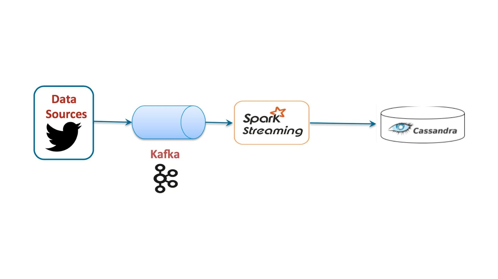

# Sentiment Analysis of Cities using Twitter Streaming Data

## Project Description
This GitHub repository contains the code for an academic project completed as part of the __ID2221 Data Intensive Computing__ course at KTH Royal Institute of Technology. The project focuses on Sentiment Analysis of Cities using Twitter Streaming Data. It makes use of Kafka as message broker, Spark Streaming for streaming operations and Cassandra for storing results. The code is well-commented and organized for easy understanding and replication of the project's results.

## Technologies Used
Kafka, Spark Streaming, and Cassandra.

## How the project was conducted
### Architecture

Our project's architecture is made up of various components that are connected together. The data processing pipeline is made up of a script to retrieve data from Twitter, Kafka as a message broker, and spark streaming to actually clean and process the data. Finally, the results are saved on Cassandra, a NoSQL database.

### Data Ingestion from twitter (kafka producer)
We got access to twitter data through the Twitter’s API - version 2, which allowed us to get the data in a streaming fashion. The retrieved data are tweets with text, hashtags, and user info, in the processing phase we discarded all the useless information. 
To be able to use the APIs with Python and retrieve the data with some filters, we used the Tweepy Library. Indeed, we filtered tweets containing one of those three cities (London, Chicago).
In addition, we've created a kafka producer that directs the stream into a kafka topic, where the messages are structured in the standard pair <k,v> with the city name as key and the tweet text as value.

### Spark streaming (kafka consumer)
We used Spark Streaming to process the tweets stored in Kafka. This framework is ideal for processing data in real time while using high-level APIs and a micro batching strategy.
We also used PySpark to code this part, because we are more familiar with  Python and also it contains some useful libraries for our purpose.
First, we created the Spark session and configured the Kafka connector. We created a “readstream” with all of the properties required to read data from the specified topic on Kafka. 

To process the data, we decided to use structured streaming, which is very practical and simple to use. We treated the incoming data as a data frame and applied some ".withcolumn()" operations with some User Defined Functions inside.

The processing steps were:
Clean the tweets: remove all the unnecessary characters from the text
Apply Sentiment Analysis: we calculated sentiment analysis of each tweet using an external library called TextBlob

At this point, we decided to aggregate data using a 5 seconds window and average the sentiment score for each city. We used the ".groupBy()" function to accomplish this.
We decided to average the data in a window to produce a more robust result that was less influenced by outliers.

The processed stream of data is sink to Cassandra to be stored. In order to do that we used “.writestrem()” with output mode “update” in this way data have an update for each new processed micro batch.

### Cassandra
For Cassandra we used a Python driver called Datastax, in this way we were able to directly create keyspace and tables, insert data and query the database directly from Python. 
We created a Keyspace and a Table with the following column structure (windowstart timestamp, windowend timestamp, key_str text, sentiment float).
The data were inserted in the table directly from Spark using the connector. 
We query the data using the function “session.execute()” by Datastax that lets you define a query directly in CQL. The query was very easy and simply extracted all the relevant data for each city. 
We created a Pandas dataframe with the extracted data, in this way we were able to plot it using the Matplotlib library. 
We Plot different subchart for each city with the axis X being the date time and the axis Y being the level of sentiment (ranging from -1 to 1). In the figure below, a sample output of the system can be seen for Chicago and London for a timespan of roughly four minutes.

### Results
Finally, we were able to correctly extract and process streaming data from Twitter. The plot demonstrates that we can grasp and comprehend a city's general mood over the course of hours and days. 
The issue was that we aggregated data with a too-short window, so we don't have a strong and reliable value for sentiment. A further improvement could be to aggregate the data in the final phase, say every ten minutes, to achieve the desired output. 

## Requirements

| Plugin | README |
| ------ | ------ |
| Java | [https://www.oracle.com/uk/java/technologies/javase/javase8-archive-downloads.html][PlDb] |
| Anaconda | [https://www.anaconda.com/products/distribution][PlGh] |
| Kafka | [(https://downloads.apache.org/kafka/3.2.1/kafka_2.12-3.2.1.tgz)][PlGd] |
| Cassandra | [https://dlcdn.apache.org/cassandra/3.11.13/apache-cassandra-3.11.13-bin.tar.gz][PlOd] |

Anaconda provides: Python, Jupyter-Notebook etc. 

## Steps to run the application: 

### Start Kafka (in kafka folder)

<ol>
  <li>bin/zookeeper-server-start.sh config/zookeeper.properties</li>
  <li>bin/kafka-server-start.sh config/server.properties</li>
  <li> bin/kafka-topics.sh --create --topic saCity --bootstrap-server localhost:9092</li>
  <li>!!useful command to gain conherent data after reexecution:  bin/kafka-topics.sh --zookeeper localhost:2181 --delete --topic saCity </li>
</ol> 

### Run TwttrStreamingAPI.ipynb  
Required libraries: time, tweepy, kafka

### Start Cassandra (in cassandra folder) 
bin/cassandra -f

### Run Section 1: Cassandra Setup in CassandraSetupAndDataVisualization.ipynb
Required libraries: cassandra-driver, matplotlib, pandas

### Run SparkStreamToCassandra.ipynb
Required libaries: pyspark, textblob

### Run Section2: Data Visualization in CassandraSetupAndDataVisualization.ipynb
Libraries allready satisfied for section1 

[//]: # (These are reference links used in the body of this note and get stripped out when the markdown processor does its job. There is no need to format nicely because it shouldn't be seen. Thanks SO - http://stackoverflow.com/questions/4823468/store-comments-in-markdown-syntax)

   [dill]: <https://github.com/joemccann/dillinger>
   [git-repo-url]: <https://github.com/joemccann/dillinger.git>
   [john gruber]: <http://daringfireball.net>
   [df1]: <http://daringfireball.net/projects/markdown/>
   [markdown-it]: <https://github.com/markdown-it/markdown-it>
   [Ace Editor]: <http://ace.ajax.org>
   [node.js]: <http://nodejs.org>
   [Twitter Bootstrap]: <http://twitter.github.com/bootstrap/>
   [jQuery]: <http://jquery.com>
   [@tjholowaychuk]: <http://twitter.com/tjholowaychuk>
   [express]: <http://expressjs.com>
   [AngularJS]: <http://angularjs.org>
   [Gulp]: <http://gulpjs.com>

   [PlDb]: <https://github.com/joemccann/dillinger/tree/master/plugins/dropbox/README.md>
   [PlGh]: <https://github.com/joemccann/dillinger/tree/master/plugins/github/README.md>
   [PlGd]: <https://github.com/joemccann/dillinger/tree/master/plugins/googledrive/README.md>
   [PlOd]: <https://github.com/joemccann/dillinger/tree/master/plugins/onedrive/README.md>
   [PlMe]: <https://github.com/joemccann/dillinger/tree/master/plugins/medium/README.md>
   [PlGa]: <https://github.com/RahulHP/dillinger/blob/master/plugins/googleanalytics/README.md>
